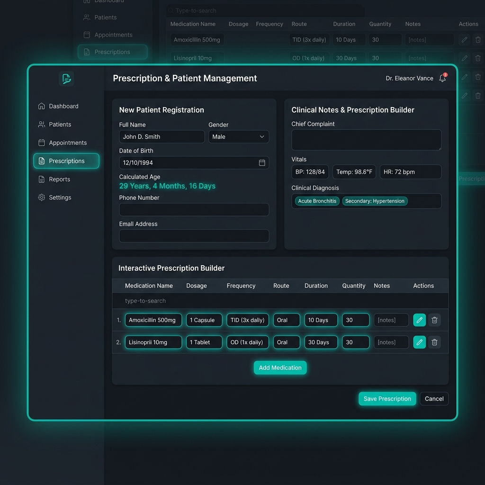
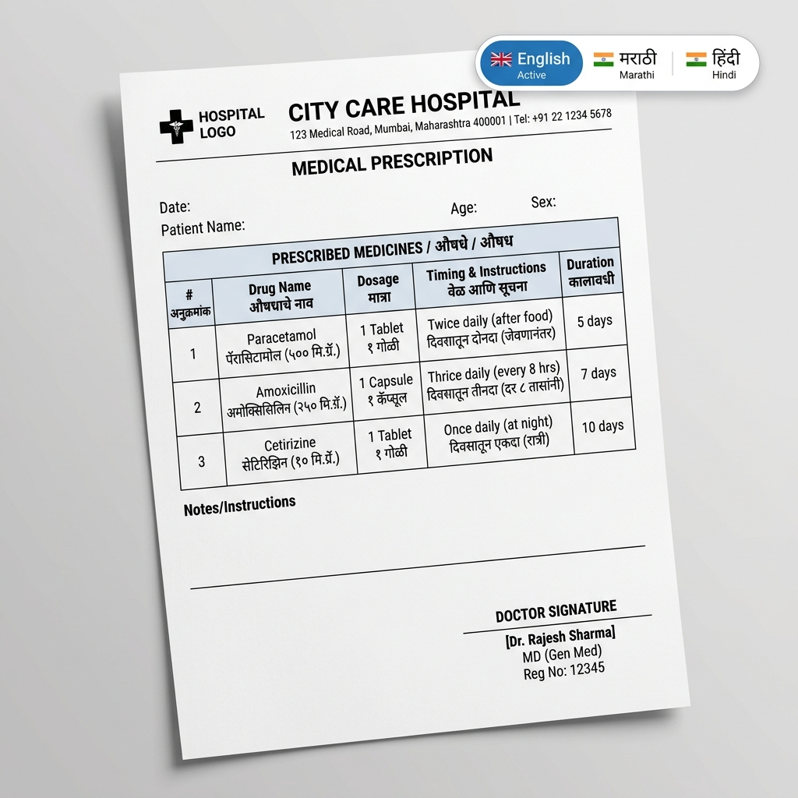
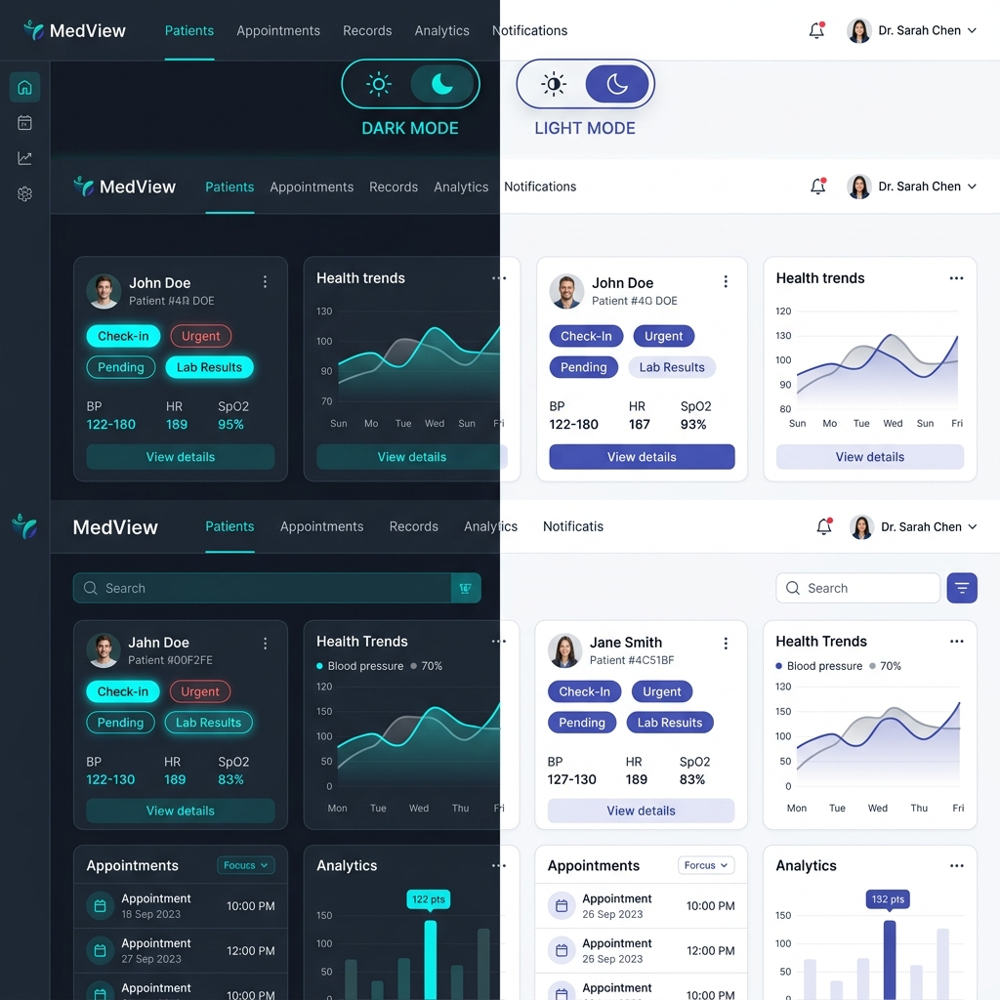

# Prescripto - Doctor Prescription & Pharmacy Management System

[](file:///d:/MASAI/Prescripto/DEVELOPMENT.md) [](LICENSE)

**Prescripto** is an integrated full-stack healthcare platform bridging clinic operations with medical store inventory management. It features dynamic patient age calculation, live pharmacy stock monitoring, atomic stock deduction during dispensing, multi-language prescription printing (**English**, **मराठी**, **हिंदी**), dual Light/Dark theme support, and complete REST & GraphQL APIs.

---

## 📸 Complete Application Screen Tour & Interface Guide

### 1. Doctor Dashboard & Patient Management Interface
- **Dynamic Real-Time Age Calculator**: Automatically computes the patient's age in **years, months, and days** (e.g. `29 Years, 4 Months, 16 Days`) as soon as the Date of Birth is selected.
- **Interactive Prescription Generator**: Allows doctors to construct multi-line item prescriptions by selecting medicines from store inventory, specifying dosage (e.g. `500mg`), frequency (e.g. `1-0-1`), duration in days, prescribed quantity, and dietary instructions.
- **Patient Search & History**: Instant search filter by patient name or village/location.



---

### 2. Pharmacist Inventory & Medical Store Dashboard
- **Live Inventory Monitor**: Displays available stock with color-coded status pills:
  - 🟢 **Available**: Stock exceeds minimum alert threshold.
  - 🟡 **Low Stock Alert**: Quantity $\le$ `min_stock_alert` threshold (pulsing warning).
  - 🔴 **Expired / Out of Stock**: Expiry date passed or quantity equals 0.
- **Add New Medicine Modal**: Form fields for Medicine Name, Category (Antibiotic, Analgesic, Antacid), Dosage Form (`Tablet`, `Capsule`, `Syrup`, `Injection`, `Ointment`, `Drops`), Initial Stock Quantity, Unit Price, Batch Number, and Expiry Date.
- **Stock Update / Restock Modal**: Quick stock incrementer with transaction notes logging to `StockTransaction`.


---

### 3. Multi-Language Prescription Printing (English, मराठी, हिंदी)
- **i18n Multi-Language Selector**: Toggle between **English**, **मराठी (Marathi)**, and **हिंदी (Hindi)** to instantly translate dosage instructions, timing ("After Meal" $\rightarrow$ "जेवणानंतर" / "खाने के बाद"), frequencies ("1-0-1" $\rightarrow$ "सकाळी व रात्री" / "सुबह एवं रात"), and medical notices.
- **Professional Print-Only CSS Template**: Triggers clean browser printing (`window.print()`) showing hospital logo, doctor signature seal, patient diagnosis, and medicine schedule.



---

### 4. Dual Theme Support: Light & Dark Mode
- Both the Vanilla JS UI and the Next.js React Component support seamless switching between **Dark Mode** (Glassmorphic Deep Slate `#0f172a`) and **Light Mode** (Crisp Slate/Indigo `#f8fafc`).
- Toggle button available in the top navbar header.



---

## 🏗️ Repository Architecture

```
Prescripto/
├── docs/
│   └── images/                     # Feature Screenshots & Interface Diagrams
│       ├── doctor_dashboard.png
│       ├── pharmacist_inventory.png
│       ├── prescription_print_i18n.png
│       └── light_dark_theme.png
│
├── backend/                        # Python FastAPI Backend API
│   ├── app/
│   │   ├── api/                    # REST API Endpoints (Auth, Clinic, Patients, Inventory, Prescriptions)
│   │   ├── core/                   # Config, Database Session, JWT Security
│   │   ├── graphql/                # Strawberry GraphQL Engine & Resolvers
│   │   ├── models/                 # SQLAlchemy ORM Models (with @property age)
│   │   ├── mongo_models/           # MongoDB Document Schemas (ODM Alternative)
│   │   ├── schemas/                # Pydantic Schemas with Dynamic Age
│   │   └── main.py                 # FastAPI Application Entrypoint
│   ├── tests/                      # Pytest Suite (4/4 PASSED)
│   ├── pyproject.toml              # Backend Package & Versioning (v1.1.0)
│   ├── .env                        # Environment Configuration
│   └── requirements.txt
│
├── frontend/                       # Web App Interfaces
│   ├── components/                 # React Next.js Components
│   │   ├── InventoryDashboard.tsx  # Next.js React Medical Store Component
│   │   └── PrescriptionPrintTemplate.tsx # React Printable Prescription Component (i18n)
│   ├── utils/
│   │   └── i18n.ts                 # Translation Dictionary (en, mr, hi)
│   ├── index.html                  # Glassmorphic Web App UI
│   ├── style.css                   # Custom CSS Design System (Light & Dark Theme)
│   ├── app.js                      # Client State & API Integration
│   ├── package.json                # Frontend Package & Versioning (v1.1.0)
│   └── .env                        # Frontend Environment Configuration
│
├── DEVELOPMENT.md                  # Git Branching Strategy & Versioning Protocol
└── README.md                       # Comprehensive Documentation
```

---

## ⚡ Quick Start Guide

### 1. Run Backend Server
```bash
cd backend
py -m pip install -r requirements.txt
py -m uvicorn app.main:app --host 127.0.0.1 --port 8080 --reload
```
- **REST API Docs**: [http://127.0.0.1:8080/docs](http://127.0.0.1:8080/docs)
- **GraphQL IDE**: [http://127.0.0.1:8080/graphql](http://127.0.0.1:8080/graphql)

### 2. Run Backend Test Suite
```bash
cd backend
py -m pytest tests/
```

### 3. Run Frontend Web App
```bash
cd frontend
py -m http.server 3000
```
Open [http://127.0.0.1:3000](http://127.0.0.1:3000) in your browser.

---

## 🌿 Git Branching Strategy & Versioning Protocol

Every new feature or bugfix follows an isolated branching strategy and synchronized versioning policy (detailed in [DEVELOPMENT.md](file:///d:/MASAI/Prescripto/DEVELOPMENT.md)):

- **Feature Branching**: Developers branch off `main` using `feature/<feature-name>` (e.g. `feature/v1.1.0-print-i18n`).
- **Synchronized Versioning**: Backend (`backend/pyproject.toml`, `backend/app/core/config.py`) and Frontend (`frontend/package.json`, `frontend/.env`) maintain synchronized semantic versioning (`v1.1.0`).

---

## 📜 License, Terms & Credentials

- **[LICENSE](file:///d:/MASAI/Prescripto/LICENSE)**: MIT License Copyright (c) 2026 Akshay Bombatkar.
- **[Terms & Conditions](file:///d:/MASAI/Prescripto/TERMS_AND_CONDITIONS.md)**: Healthcare Disclaimer & Acceptable Use Policy.
- **[Credentials & Security Guide](file:///d:/MASAI/Prescripto/CREDENTIALS.md)**: Development demo credentials & production deployment checklist.

